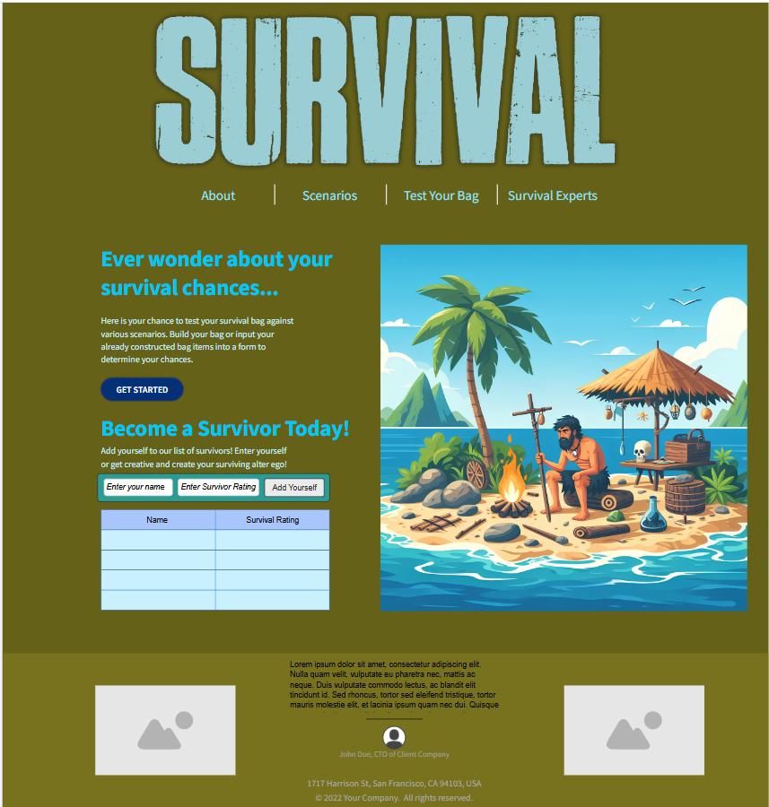

# Web Dev Starter Code

## Project Spec

What is the general theme?

So my general theme is a survival bag builder which generates a survival rating for users. It provides them with the information if their bag is adequate or not for surviving various survival scenarios. I am planning to have a lot of fun with it in which people can go to fictious expert survivors for advice such as Ellie Williams, Rick Grimes, or other fun characters. All joking aside, I will add real expert survivors such as Bear Grylls. So overall the genre spanning apocalypse and survival.

What is it going to do? 

It is going to draw people into the art of building a survival pack and have a good time while doing it. It not only helps the person build their bag, but also takes a fun twist to surviving techniques, differing situations (I hope to add a zombie apocalypse one for fun), and the affordability of these items. As a person who has built my own survival pack and am still adding components to it, it can be a perilous journey for others who either don't have the knowledge behind the hard skillsets or have the knowledge, yet unsure of which product is better. It will hopefully give people an idea about what is a prepper or survivalist and shed light onto the specifics of the skillsets that enhance your overall capability when put into a treacherous situation in an unforgiving environment. I hope to educate, give a laugh, and introduce people to the art of surviving! I hope to add some fun buttons that have different functions throughout and make the page pretty interactive. Like discovering what goes in a bag, discover what fun lies within my website! 

Who is the target audience?

The target audience for this I would say is the general public over a wide range of ages. I hope that there will be a little bit of something for everyone no matter what age. 

What sort of data will it manage?

I think for my project most of the data that will be managed with my website will be inputs from the users. I thought it maybe interesting to have images, but don't want to get ahead of myself neccessarily for the scope of this project. It will also manage a survivors list and hopefully a previous ratings and items list as a reference for new bag builds or people who are unsure of what to do.

Stretch Goals?

Honestly, I would love to implement a mini game on it! Maybe something along the lines of like the Fear the Walking Dead Run/Temple Run where you can pick your scenario. I think I'd also like to expand the features so that with getting advice from the expert survivors that they could be interactive based on input. Sort of along the lines of AI, not exactly sure with this one, but I think it would be a lot of fun just to take a stab at it. Overall, I think making it as interactive as possible is the biggest goal, so maybe eventually I could get it to wear the bag is an actual bag that you can drag and drop items into and it will register the picture and register it in the database that way! I am not sure if this is within my skillset however if I have learned anything from survival techniques, you make it work with what you got!

## Project Wireframe

Here is my project Wireframe! I didn't do each of the separate pages individually as I have to leave something to mystery! Also, they will be structured similarly just functionality will change!

